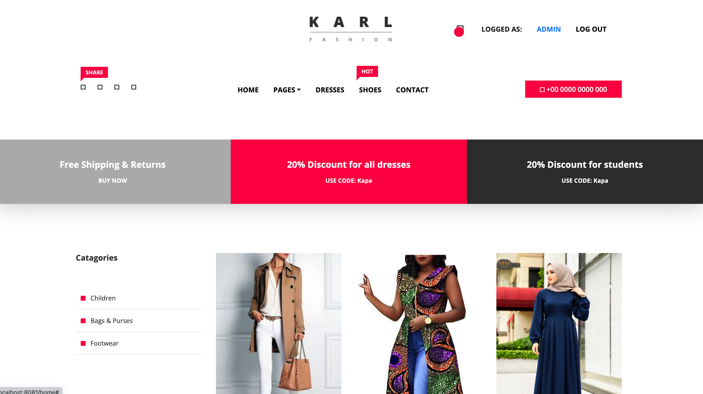

# **Spring Boot - Shop Code**

[//]: # ()

## Description
A clothes for men Application 

## Screenshots



## Installation

You can clone this repository and use it localy:
```sh
$ https://github.com/archanajanamolla/Clothes4men.git
```

**Using Maven plugin**

First you should do clean installation:
```sh
$ mvn clean install
```
You can start application using Spring Boot custom command:
```sh
$ mvn spring-boot:run
```

**Using Maven plugin and running JAR**

You can create JAR file using:
```sh
$ mvn clean package
```
and then run it with:
```sh
$ java -jar target/shop-x.x.x.jar
```

## Logins

Initially there are 2 users in memory:

Login: ```admin``` Password: ```admin``` with **ADMIN** role.

Login: ```user``` Password: ```user``` with **USER** role.

## Roles

**ADMIN** can add, edit and delete products.

**USER** can add products to shopping cart and buy them.

## Tests


You can run tests using:
```sh
$ mvn test
```

## License

Project is based on **MIT License**. You can read about the license <a href="LICENSE">here</a>.
